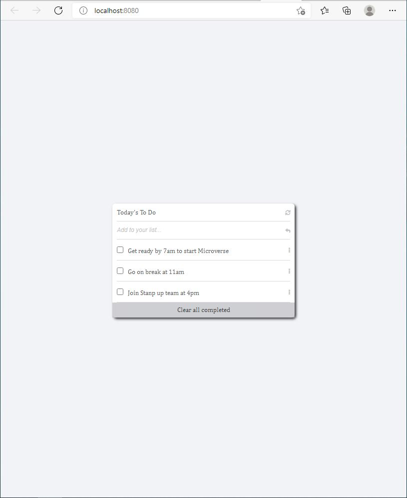

# To-Do-list-App

This project is to create a responsive Todo list app which allows you to add and remove a task. The design was gotten from minimalist.
## Live Demo

[Live Demo Link](https://raw.githack.com/Kossi-stack/Mobile_Version_Skeleton/github-deployment/index.html)

## Built With

- Html
- Css
- JavaScript

##  Prerequisites

- Text editor
- Git
- Html
- Css

## Getting Started

To get a local copy up and running follow these simple example steps.

- You can clone this repo by typing git clone `https://github.com/Kossi-stack/To-Do-list-App.git` on your terminal
- Type cd `To-Do-list-App` to access the project on the terminal

## Author

👤 **Kossi-Stack**

- GitHub: [@githubhandle](https://github.com/Kossi-stack/Mobile_Version_Skeleton)
- LinkedIn: [LinkedIn](https://www.linkedin.com/in/kossifioklou2406/)

## 🤝 Contributing

Contributions, issues, and feature requests are welcome!

Feel free to check the [issues page](https://github.com/Kossi-stack/To-Do-list-App/issues).

## Show your support

Give a ⭐️ if you like this project!

## 📝 License

This project is [MIT](./MIT.md) licensed.
